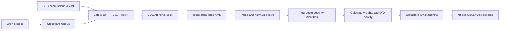

# Signal13F

<p>
  <a href="https://portfolio-of-superinvestors.kkertin1214.workers.dev"></a>
  
  
  
  
  
</p>

Signal13F is a Bloomberg-inspired institutional holdings monitor for following a focused list of notable investment managers. It parses official SEC Form 13F filings, calculates portfolio concentration and quarter-over-quarter activity, and presents the results through a dense, legible financial-data interface.

**[Open the live application →](https://portfolio-of-superinvestors.kkertin1214.workers.dev)**

## Why Signal13F

Many 13F aggregators update slowly, mix filing data with estimates, or obscure the original source. Signal13F keeps the data path short and auditable:

- **Official sources only** — holdings come directly from SEC EDGAR submissions and information-table XML files.
- **Deadline-aware updates** — submissions are checked during the quarterly 13F deadline windows instead of being polled continuously all year.
- **Persistent delivery** — user requests read pre-parsed Cloudflare KV snapshots and never call SEC EDGAR directly.
- **No synthetic enrichment** — no mock positions, inferred tickers, estimated prices, or silently merged external datasets.
- **Manager-level analysis** — disclosed value, position count, concentration, allocation, and quarterly share-count changes.
- **Source traceability** — every manager page links to the original SEC filing.
- **Financial-terminal design** — Bloomberg-inspired hierarchy, typography, tables, and allocation charts.

## Tracked managers

| Manager | SEC CIK | Route |
| --- | ---: | --- |
| Berkshire Hathaway | `0001067983` | `/investors/berkshire-hathaway` |
| Pershing Square Capital Management | `0001336528` | `/investors/pershing-square` |
| Bridgewater Associates | `0001350694` | `/investors/bridgewater-associates` |
| Tiger Global Management | `0001167483` | `/investors/tiger-global` |
| Duan Yongping · H&H International Investment | `0001759760` | `/investors/hh-international-investment` |
| Li Lu · Himalaya Capital Management | `0001709323` | `/investors/himalaya-capital-management` |
| Leopold Aschenbrenner · Situational Awareness LP | `0002045724` | `/investors/situational-awareness` |
| Seth Klarman · Baupost Group | `0001061768` | `/investors/baupost-group` |
| Terry Smith · Fundsmith LLP | `0001569205` | `/investors/fundsmith` |
| David Tepper · Appaloosa LP | `0001656456` | `/investors/appaloosa` |
| Chuck Akre · Akre Capital Management | `0001112520` | `/investors/akre-capital-management` |
| Daniel Loeb · Third Point LLC | `0001040273` | `/investors/third-point` |
| Stanley Druckenmiller · Duquesne Family Office | `0001536411` | `/investors/duquesne-family-office` |
| Peter Thiel · Thiel Macro LLC | `0001562087` | `/investors/thiel-macro` |
| California Public Employees' Retirement System (CalPERS) | `0000919079` | `/investors/calpers` |
| Canada Pension Plan Investment Board (CPP Investments) | `0001283718` | `/investors/cpp-investments` |
| California State Teachers' Retirement System (CalSTRS) | `0001081019` | `/investors/calstrs` |
| Temasek Holdings | `0001021944` | `/investors/temasek-holdings` |
| Saudi Public Investment Fund | `0001767640` | `/investors/saudi-public-investment-fund` |

The tracked universe is intentionally curated. Manager definitions and the distinction between `SUPERINVESTOR` and `GLOBAL ASSET OWNER` live in `src/lib/portfolio.ts`.

## Product surface

### Manager overview

The homepage ranks available managers by the disclosed value of their latest public 13F and shows:

- total disclosed portfolio value;
- number of reportable positions;
- reporting period and filing timestamp;
- live source availability;
- direct navigation to each portfolio.
- manager and investor-name search with initial-letter filtering.

### Portfolio detail

Every tracked manager has a dedicated page containing:

- a Bloomberg-style doughnut chart of holdings by disclosed value;
- top-ten concentration and portfolio-level KPIs;
- current, prior, new, added, reduced, unchanged, and sold-out counts;
- a searchable and filterable current-holdings table;
- quarter-over-quarter share-count changes;
- the filing accession number and original SEC document link.

## Data pipeline



The parser performs the following steps:

1. Fetches `https://data.sec.gov/submissions/CIK##########.json` for each configured manager.
2. Selects the newest `13F-HR` or `13F-HR/A` submission.
3. Resolves the filing archive and identifies its information-table XML document.
4. Parses `informationTable.infoTable` entries with `fast-xml-parser`.
5. Normalizes issuer names, disclosed values, share amounts, CUSIPs, and security classes.
   Manager-level value scaling is explicit for legacy filings that still report holdings in thousands of dollars.
6. Aggregates duplicate filing rows by CUSIP and security class.
7. Calculates each position's share of total disclosed value.
8. Compares current and prior filings by security identity to classify positions as `NEW`, `ADDED`, `REDUCED`, `UNCHANGED`, or `SOLD`.
9. An hourly Cron Trigger runs only from the 11th through the 18th of February, May, August, and November.
10. The trigger writes one queue message per manager; a concurrency-one consumer spaces SEC work across independent invocations and retries transient failures with delay.
11. Updated current/prior comparisons are written to Workers KV. Homepage and detail requests only read those persisted snapshots.

CUSIP and security-class fields remain internal identity keys. They are deliberately omitted from the visible holdings tables because they add little value for the intended audience.

## Architecture

| Layer | Implementation |
| --- | --- |
| Framework | Next.js 16 App Router and React 19 Server Components |
| Styling | Scoped CSS Modules with a documented semantic typography system |
| Data parsing | Native `fetch` and `fast-xml-parser` |
| Persistence | Workers KV, one versioned comparison snapshot per manager |
| Background work | Cron Triggers and Cloudflare Queues with delayed retries |
| Hosting | OpenNext on Cloudflare Workers |
| Deployment | Wrangler |
| Primary source | SEC EDGAR submissions and filing archives |

The ingestion Worker is isolated from the user-facing OpenNext Worker. Queue messages are consumed one manager at a time, while the frontend performs a single multi-key KV read for its directory and one KV read for a manager detail page.

## Repository structure

```text
src/
├── app/
│   ├── globals.css                         # Global tokens and base styles
│   ├── page.tsx                            # Manager overview
│   ├── page.module.css                     # Overview presentation
│   └── investors/
│       ├── [slug]/                         # Shared portfolio implementation
│       │   ├── doughnut-chart.tsx
│       │   ├── holdings-table.tsx
│       │   ├── page.module.css
│       │   └── page.tsx
│       └── <manager-slug>/page.tsx         # Explicit Cloudflare routes
└── lib/
    ├── portfolio.ts                        # Manager registry, types, comparisons
    ├── sec-ingestion.ts                    # Bounded SEC client and XML parser
    └── sec.ts                              # Read-only KV access for Next.js

worker/ingest.ts                            # Queue, Cron, retry, and KV writes
scripts/seed-snapshots.ts                   # First-run snapshot initialization

AGENTS.md                                   # Next.js and typography conventions
open-next.config.ts                         # OpenNext adapter configuration
wrangler.jsonc                              # Cloudflare Worker configuration
wrangler.ingest.jsonc                       # Ingestion Worker configuration
```

## Getting started

### Prerequisites

- Node.js 20.9 or newer
- npm
- A Cloudflare account with Workers, KV, Queues, and Cron Triggers enabled

### Installation

```bash
git clone https://github.com/kertin9912/portfolio-of-superinvestors.git
cd portfolio-of-superinvestors
npm install
```

Start the development server:

```bash
npm run dev
```

Open [http://localhost:3000](http://localhost:3000).

## Available commands

| Command | Purpose |
| --- | --- |
| `npm run dev` | Start the local Next.js development server |
| `npm run lint` | Run ESLint |
| `npm run build` | Create a production Next.js build and run type checking |
| `npm run preview` | Build with OpenNext and run a Cloudflare preview |
| `npm run deploy` | Build and deploy the Worker with Wrangler |
| `npm run deploy:ingest` | Deploy the scheduled ingestion Worker |
| `npm run seed:snapshots -- <directory>` | Parse initial SEC snapshots into a local staging directory |
| `npm run cf-typegen` | Regenerate Cloudflare environment types |

## Validation

Run the required local checks before opening a pull request:

```bash
npm run lint
npm run build
npm exec -- opennextjs-cloudflare build
```

When changing presentation code, also verify:

- the homepage and every manager route render successfully;
- there is no document-level horizontal overflow;
- allocation legends and holdings tables remain readable;
- no critical financial value is rendered below the typography minimums in `AGENTS.md`.

## Cloudflare deployment

OpenNext and Wrangler are already configured for the Worker named `portfolio-of-superinvestors`.

Authenticate Wrangler and create the KV namespace and queue named in the configs:

```bash
npx wrangler login
```

Then deploy:

```bash
npm run deploy
npm run deploy:ingest
```

Never commit contact emails, API credentials, or `.env.local` files.

## Data semantics and limitations

Form 13F is a delayed regulatory disclosure, not a real-time portfolio ledger.

- Values represent the filing's reporting-period disclosure and are not live market values.
- Managers generally file within 45 days after quarter end.
- Short positions, cash, many derivatives, and non-reportable assets are outside the standard 13F information table.
- A position marked `SOLD` means it disappeared from the next comparable 13F; it does not identify the trade date.
- Share-count changes do not account for every possible corporate action.
- Amendments can replace or supplement earlier filings.

Signal13F prioritizes faithful presentation of the public filing over speculative reconstruction.

## Contributing

Issues and pull requests are welcome.

1. Fork the repository and create a focused branch.
2. Keep SEC parsing changes source-backed and free of mock production data.
3. Follow the typography and Next.js conventions in `AGENTS.md`.
4. Run lint, type checking, production build, and relevant browser checks.
5. Describe the user-visible change and any data-quality implications in the pull request.

When proposing a new manager, include the official SEC CIK and verify that the filer publishes Form 13F information tables.

## Security and responsible use

- Do not commit secrets or personal credentials.
- Respect SEC fair-access guidance and retain a descriptive user agent.
- Avoid aggressive polling outside the application's cache and revalidation strategy.
- Treat filing data as public regulatory disclosure, not investment advice.

## Disclaimer

Signal13F is an independent research interface and is not affiliated with Bloomberg, the U.S. Securities and Exchange Commission, or any tracked investment manager. The project is provided for informational purposes only and does not constitute investment, legal, tax, or financial advice.

## Keywords

`13F` · `SEC EDGAR` · `superinvestors` · `institutional holdings` · `portfolio tracker` · `Next.js` · `React` · `Cloudflare Workers` · `OpenNext` · `financial data visualization`
